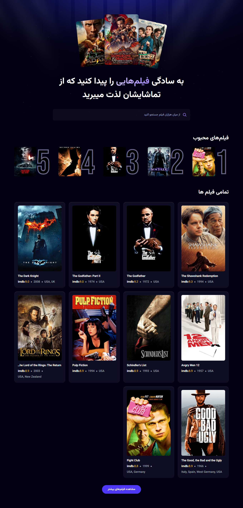

# React Movie Project

A responsive movie application built with React, Vite, and Tailwind CSS, fetching data dynamically from an API and providing an interactive user experience.

---

## 📖 Overview
This project is a front-end React application that displays movie information retrieved from an external API.  
Users can search for movies using an active search bar and view details such as posters, ratings, and release dates.  
The project is built with **Vite** for fast bundling, **Tailwind CSS** for styling, and modern React practices including functional components and hooks.

---

## ✨ Key Features
- Responsive layout built with Tailwind CSS
- Fetching data from an external movie API
- Active search bar to filter movies in real-time
- Display of movie posters, ratings, and release dates
- Modular React components with clean structure
- Functional components and React Hooks (useState, useEffect)
- Error handling for API requests
- Mobile-first design

---

## 🛠 Tech Stack
- React (Functional Components, Hooks)
- Vite (Fast Development Bundler)
- Tailwind CSS (Utility-first Styling)
- JavaScript (ES6+)
- Fetch API / Axios
- Git & GitHub

---

## 🎯 Goals / What I Learned
- Fetching and displaying data from an external API
- Implementing a live search feature with React
- Organizing components for scalability and reusability
- Using React state and effects to manage dynamic UI
- Applying Tailwind CSS for responsive design
- Understanding the workflow of modern front-end projects with Vite

---

---

## 🖼 Screenshots

